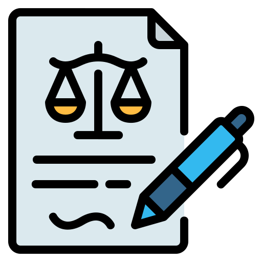

<a name="readme-top"></a>
[![Contributors][contributors-shield]][contributors-url]
[](https://github.com/achouhan93/LexDrafter/forks)
[![Stargazers][stars-shield]][stars-url]
[![Issues][issues-shield]][issues-url]
[![MIT License][license-shield]][license-url]

<!-- PROJECT LOGO -->
<br />
<div align="center">
  <a href="https://github.com/achouhan93/LexDrafter">
    
  </a>

  <h3 align="center">LexDrafter: Terminology Drafting for Legislative Documents using Retrieval Augmented Generation</h3>

  <p align="center">
   Ashish Chouhan and Michael Gertz 
   
   Heidelberg University
   
   Contact us at: [`{chouhan, gertz}@informatik.uni-heidelberg.de`](mailto:chouhan@informatik.uni-heidelberg.de)
    <a href="https://github.com/achouhan93/LexDrafter/issues">Report Bug</a> · <a href="https://github.com/achouhan93/LexDrafter/issues">Request Feature</a>
  </p>
</div>


<!-- TABLE OF CONTENTS -->
<details>
  <summary>Table of Contents</summary>
  <ol>
    <li>
      <a href="#about-the-project">About The Project</a>
      <ul>
        <li><a href="#abstract">Abstract</a></li>
        <li><a href="#lexdrafter-workflow">LexDrafter Workflow</a></li>
      </ul>
    </li>
    <li>
      <a href="#getting-started">Getting Started</a>
      <ul>
        <li><a href="#setting-up-the-environment">Setting up the environment</a></li>
        <li><a href="#code-base-information">Code Base Information</a></li>
      </ul>
    </li>
    <li><a href="#cite-our-work">Cite our work</a></li>
    <li><a href="#license">License</a></li>
    <li><a href="#acknowledgments">Acknowledgments</a></li>
  </ol>
</details>


<!-- ABOUT THE PROJECT -->
## About The Project
A [pre-print](https://arxiv.org/abs/2403.16295) of our work is available; it has also been accepted for the main conference of LREC-COLING 2024. The conference proceedings will be available in May 2024.

### Abstract
With the increase in legislative documents at the EU, the number of new terms and their definitions is increasing as well. As per Joint Practical Guide, terms used in legal documents shall be consistent, and identical concepts
shall be expressed without departing from their meaning in ordinary, legal, or technical language. Thus, while drafting a new legislative document, having a framework that provides insights about existing definitions and
helps define new terms based on a document’s context will support such harmonized legal definitions across different regulations and thus avoid ambiguities. In this paper, we present LexDrafter, a framework that assists in drafting Definitions articles for legislative documents using retrieval augmented generation (RAG) and existing term definitions present in different legislative documents. For this, definition elements are built by extracting definitions from existing documents. Using definition elements and RAG, a Definitions article can be suggested on demand for a legislative document that is being drafted. We demonstrate and evaluate the functionality of LexDrafter using a collection of EU documents from the energy domain. The code for LexDrafter framework is available at https://github.com/achouhan93/LexDrafter.

### LexDrafter Workflow
LexDrafter functions help users when drafting a legal act, in particular when drafting document sections has been completed, but the section with terminology definitions (the Definitions article) is missing. The fragments that include a given term in the drafted sections are the key components required
by LexDrafter, as such fragments provide contextual information for the definition of a term using our
RAG approach. In our work, terms for which definitions need to be determined are selected by the user. The LexDrafter framework is realized with two workflows. The first workflow (see Figure 1) takes EUR-Lex legal acts (here for the Energy domain) as input, preprocess them, and stores them in an IR system. The data acquisition process in this work is similar to the one employed by [Aumiller et al. (2022)](https://aclanthology.org/2022.emnlp-main.519/){:target="_blank"}, where a particular legal act web page is crawled to store the text and metadata in an OpenSearch instance. The stored text is further processed by `DocStruct` component to extract components from retrieved legal acts,
preprocessing and storing them in the IR system inorder to build the `Document Corpus`. On the other hand, `Definition Corpus` is built by first identifying the `Definition` article in the legal act, followed by extracted the definitions, similar to the approach proposed by [Damaratskaya 2023](https://link.springer.com/chapter/10.1007/978-3-031-47112-4_14){:target="_blank"} considering `Definitions` article present in the legal acts.

![Figure 1: LexDrafter Workflow 1][workflow-screenshot-1] <p align="center">_Figure 1: LexDrafter Workflow 1_</p>

The second workflow (see Figure 2) takes a term selected by the user and either determines existing definitions or generates a definition for that term. Existing definitions can easily be identified and retrieved from the `Definition Corpus` and new definitions are generated using a retrieval augmented generation (RAG) approach.  

![Figure 2: LexDrafter Workflow 2][workflow-screenshot-2] <p align="center">_Figure 2: LexDrafter Workflow 2_</p>

<p align="right">(<a href="#readme-top">back to top</a>)</p>

<!-- GETTING STARTED -->
## Getting Started

Clone the repository by executing the below command
  ```sh
  git clone https://github.com/achouhan93/LexDrafter.git
  ```

Navigate to the cloned repository folder
  ```sh
  cd LexDrafter
  ```

### Setting up the environment
Once the repository is successfully cloned and user navigated to the folder. 

Execute the below steps to setup Python Environment (tested with Python 3.9.0):
  1. Setup a venv with python (or `conda`)

  ```sh
  python -m venv .venv
  ```

2. Activate venv

  ```sh
  source .venv/bin/activate
  ```

3. Install all necessary dependencies by running

  ```sh
  pip install -r requirements.txt
  ```

4. Rename the `.env-example` to `.env` and populate the file with the required credentials

```sh
LOG_EXE_PATH="logs/execution.log"
LOG_PATH="logs/"

# Required for Dataset Collection, Schema Creation, and Definition Generation 
# Opensearch Connection Details
DB_USERNAME = "your_opensearch_username"
DB_PASSWORD = "your_opensearch_password"
DB_HOSTNAME = "your_opensearch_hostname"
DB_PORT = "your_opensearch_port"
DB_LEXDRAFTER_INDEX ="your_opensearch_index_name"

# Required for Schema Creation, Ground Truth Definition Corpus Creation, and Definition Generation
# Postgresql Connection Details
PG_USER = "your_postgres_username"
PG_PWD = "your_postgres_password"
PG_DATABASE = "your_postgres_database"
PG_SERVER = "your_postgres_hostname"
PG_HOST = "your_postgres_port"

# Required for Definition Generation
# HuggingFace Key
HUGGINGFACE_AUTH_KEY = "huggingface_auth_key"
```

### Code Base Information
This code base provides necessary scripts for the dataset collection process [(`code/1. dataset_collection`)](https://github.com/achouhan93/LexDrafter/tree/main/code/1.%20dataset_collection), followed by the building document corpus, i.e., storage of the document content in schema [(`code/2. docStruct_component`)](https://github.com/achouhan93/LexDrafter/tree/main/code/2.%20docStruct_component). Once the document corpus is built, the next step is to build a definition corpus using an approach similar to the one proposed by [Damaratskaya 2023](https://link.springer.com/chapter/10.1007/978-3-031-47112-4_14){:target="_blank"}. The execution of the scripts [(`code/3. defExtract_component`)](https://github.com/achouhan93/LexDrafter/tree/main/code/3.%20defExtract_component) results in building the definition corpus comprising of the existing definitions present in energy domain documents on [EUR-Lex platform](https://eur-lex.europa.eu/search.html?name=browse-by%3Alegislation-in-force&type=named&displayProfile=allRelAllConsDocProfile&qid=1710260444909&CC_1_CODED=12). As definition corpus comprises of _static_ and _dyanmic_ definitions, script present at [(`code/4. citeResolver_component`)](https://github.com/achouhan93/LexDrafter/tree/main/code/4.%20citeResolver_component) is executed to extract the citation information for the _dynamic_ definition fragments. After building document corpus and definition corpus, the next step in the framework is to check if the selected term has an existing _static_ definition/definitions or a new definition needs to be generated based on the contextual information present in the legislative document, this decision is made by the _TermRetriever_ component and scripts for this component is present at [(`code/5. termretriever_component`)](https://github.com/achouhan93/LexDrafter/tree/main/code/6.%20termretriever_component). Once decision is made by `TermRetriever` to generate new definitions for terms selected by the user using retrieval augmented generation (RAG) pipeline. Scripts present at [(`code/6. ragenerator_component`)](https://github.com/achouhan93/LexDrafter/tree/main/code/6.%20ragenerator_component) are used to generate definitions using LLAMA-2 and Vicuna. Finally, the generated definitions are compared with the ground-truth definition present in the definition corpus and evaluated on BLEU, BERTScore, and BLEURT evaluation metrics using the scripts present at [(`code/7. definition_evaluation`)](https://github.com/achouhan93/LexDrafter/tree/main/code/7.%20definition_evaluation).

<p align="right">(<a href="#readme-top">back to top</a>)</p>

<!-- CITATION -->
## Cite our work
If you use the dataset or other parts of this code base, please use the following citation for attribution:

```
@misc{chouhan2024lexdrafter,
      title={LexDrafter: Terminology Drafting for Legislative Documents using Retrieval Augmented Generation}, 
      author={Ashish Chouhan and Michael Gertz},
      year={2024},
      eprint={2403.16295},
      archivePrefix={arXiv},
      primaryClass={cs.CL}
}
```

<p align="right">(<a href="#readme-top">back to top</a>)</p>

<!-- LICENSE -->
## License

### License Information
Copyright for the editorial content of EUR-Lex website, the EU legislative document content owned by the EU, are licensed under the [Creative Commons Attribution 4.0 International licence](https://creativecommons.org/licenses/by/4.0/), i.e., CC BY 4.0 as mentioned on the official [EUR-Lex website](https://eur-lex.europa.eu/content/legal-notice/legal-notice.html#2.%20droits).  Any data artifacts remain licensed under the CC BY 4.0 license.

### License for software component
Per the recommendation of Creative Commons, we apply a separate license to the software component of this repository. We use the standard [MIT](https://choosealicense.com/licenses/mit/) license for code artifacts.
See `license/LICENSE.txt` for more information.

<p align="right">(<a href="#readme-top">back to top</a>)</p>

<!-- ACKNOWLEDGMENTS -->
## Acknowledgments

* [README template](https://github.com/othneildrew/Best-README-Template)

<p align="right">(<a href="#readme-top">back to top</a>)</p>

<!-- MARKDOWN LINKS & IMAGES -->
<!-- https://www.markdownguide.org/basic-syntax/#reference-style-links -->
[contributors-shield]: https://img.shields.io/github/contributors/achouhan93/LexDrafter.svg?style=for-the-badge
[contributors-url]: https://github.com/achouhan93/LexDrafter/graphs/contributors
[forks-shield]: https://img.shields.io/github/forks/achouhan93/LexDrafter.svg?style=for-the-badge
[forks-url]: https://github.com/achouhan93/LexDrafter/forks
[stars-shield]: https://img.shields.io/github/stars/achouhan93/LexDrafter.svg?style=for-the-badge
[stars-url]: https://github.com/achouhan93/LexDrafter/stargazers
[issues-shield]: https://img.shields.io/github/issues/achouhan93/LexDrafter.svg?style=for-the-badge
[issues-url]: https://github.com/achouhan93/LexDrafter/issues
[license-shield]: https://img.shields.io/github/license/achouhan93/LexDrafter.svg?style=for-the-badge
[license-url]: https://github.com/achouhan93/LexDrafter/blob/master/LICENSE.txt
[workflow-screenshot-1]: images/lexdrafterworkflow1.png
[workflow-screenshot-2]: images/lexdrafterworkflow2.png
